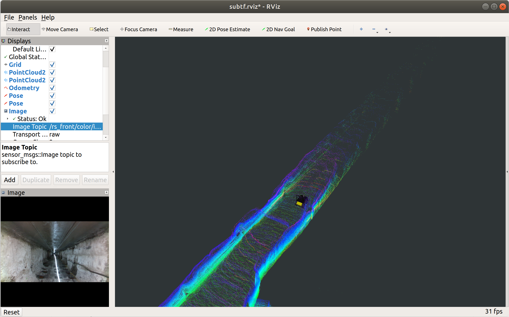

# SubT

The tools for SubT dataset released by [The Air Lab](http://theairlab.org) at [Carnegie Mellon University](https://www.cmu.edu).

# Description

   Refer to [The AirLab Dataset Instructions](http://theairlab.org/dataset/interestingness)

# This repo contains the following tools:

* PyTorch dataloader (No need to [install PyTorch](https://pytorch.org/get-started/locally/), if you don't need this function).
      
* Python evaluation tools for the daseset.

      python -m pip install --user numpy scipy matplotlib ipython jupyter pandas sympy nose

* ROS bag launchfiles and visualization (No need to [install ROS](http://wiki.ros.org/ROS/Installation), if you don't need this function).

# PyTorch dataloader

   Usage example:
         
        from subt import SubT
        import torch.utils.data as Data
        import torchvision.transforms as transforms

        transform = transforms.Compose([transforms.Resize((320,320)), transforms.ToTensor()])
        data = SubT(root='/data/location', train=False, transform=transform, test_data=1)
        loader = Data.DataLoader(dataset=data, batch_size=1, shuffle=False)

The dataloader is only for SubT front camera data (SubTF).

# Evaluation Tools

For definition of the evaluation metric, checkout [our paper](https://arxiv.org/pdf/2005.08829.pdf).

## Usage Example
You have to provide your result files.

Result example files are provided in folder 'results-example'.

For single sequence:

      python script/evaluation.py --source 'ground-truth/0817-ugv0-tunnel0-interest-1.txt' --target 'results-example/SubTF-0-2020-03-04-21:43:27-example.txt'
      # source: ground-truth file
      # target: results file

For overall performance on entire dataset:

      python script/performance.py --save-flag example --root results-example --category interest-1
      # root: location of result files
      # save-flag: flag of result files
      #     You have to name the result files following the formate of "SubTF-5-2020-03-04-22:06:43-example.txt", 
      #     where only the sequence ID, date, and time can be different.
      # category: interest-1 or interest-2

For example, after you run the following overall performance script.

      python script/performance.py --save-flag example --root results-example --category interest-2 --delta 1 2 4

You will get:

* Mean Accuracy for delta = [1,2,4], respectively.

      mean accuracy: [0.26001525 0.37333027 0.5226512 ]

* One Text file located in 'performance' folder.

      It contains data of AUC-OP (three curves for delta = [1,2,4])

* One overal performance figure, seven single sequence figures, e.g.

   
   
   
# ROS bag launchfile and visualization

To use this function, you have to put this repo in your ROS workplace and compile, e.g.,

      cd ~/catkin_ws/src
      git clone https://github.com/wang-chen/SubT.git
      cd ~/catkin_ws && catkin_make

Then run the launch file

     roslaunch SubT subt.launch

Note: you need to specify the argument 'datalocation' in 'subt.larunch' to find your bag data.
      
     <arg name="datalocation" default="/data/datasets"/>

You also need to specify the sequence ID, e.g. SubT0.

     <node pkg="rosbag" type="play" name="rosbag" args="--clock -r 3 $(arg SubT0)"/>

Then you'll get: 

   

# Citation

      @article{wang2020visual,
         title={Visual Memorability for Robotic Interestingness via Unsupervised Online Learning},
         author={Wang, Chen and Wang, Wenshan and Qiu, Yuheng and Hu, Yafei and Scherer, Sebastian},
         journal={arXiv preprint arXiv:2005.08829},
         year={2020}
         }

# [Download this paper](https://arxiv.org/pdf/2005.08829.pdf)
